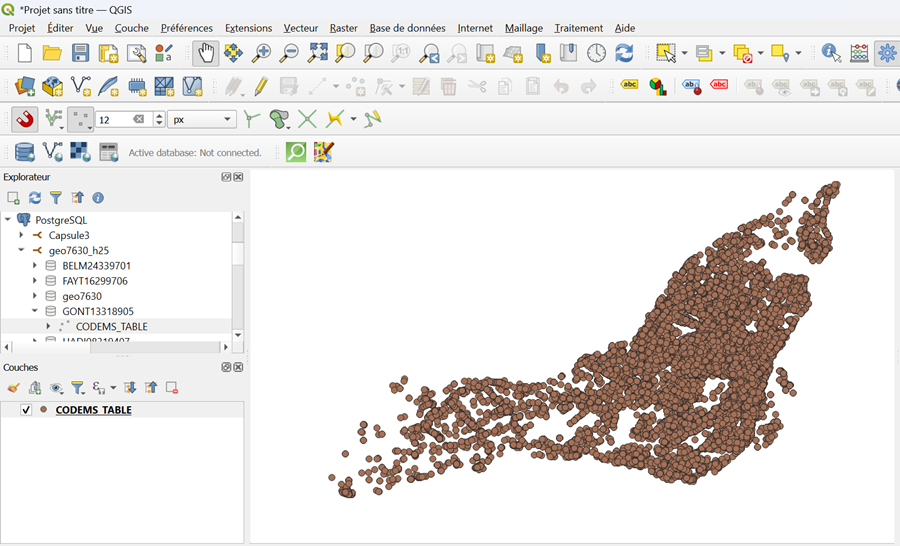

# Laboratoire_1
L'objectif de ce laboratoire est de se familiariser avec les outils Github et FME. Les tâches réalisées en général sont les suivantes :
1. Création de compte Github 
2. Création de repository et création de dossier et fichier à l'intérieur
3. Utilisation d'une base de données GeoJSON dans FME, création de reader, transformer et writer ; injecter la table dans un schéma PostgreSQL

4. Connection de la base de données à QGIS et visualisation de la carte

