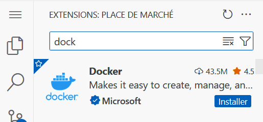
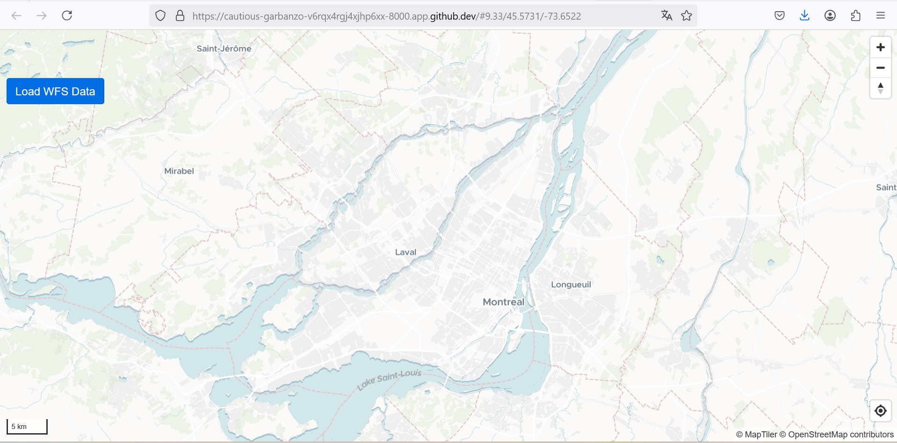
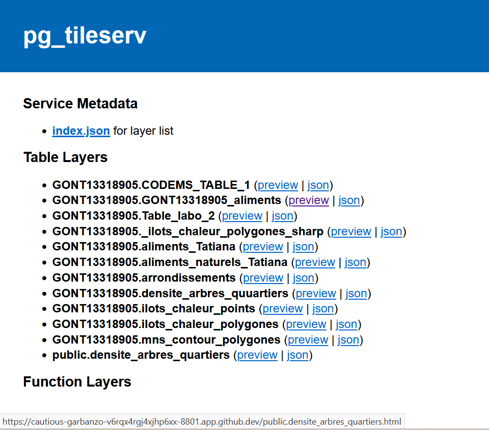
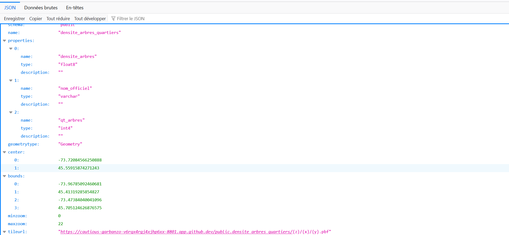
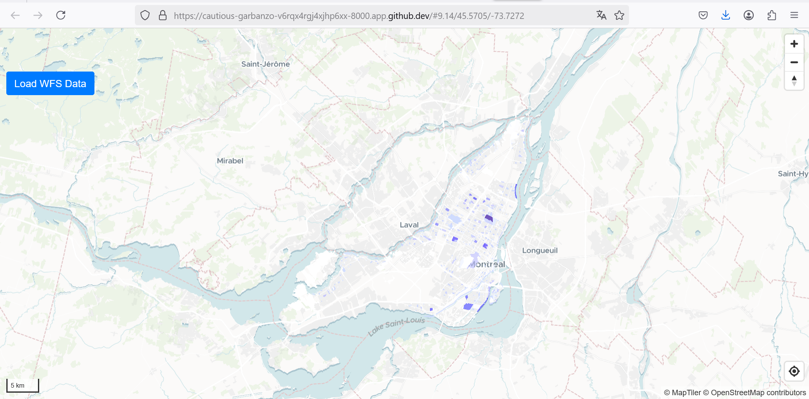

# Laboratoire 10 - GEO7630H25

# Configuration Geoserver et mise en place de services VTS et WFS

# Étape 1 : Configuration et lancement d’une instance de Geoserver

Création d'un codespace dans mon dépot github

# Étape 2 : Configuration de l’environnement

- Création des fichiers .env, app.js, app.css et index.html dans le sous_dossier "app_1" du dossier "Laboratoire10"

- Modifiez les variables d’environnement avec mes informations personnelles 

- installer docker compose

- Créer le fichier "docker-compose.yml", copier le code du docker compose de la branche github du cours et le coller dans le fichier créé

# Étape 3 : Ajout de contrôles de carte

Dans le fichier app.js, ajoutez les contrôles suivants tout en bas du code qui existait déja :

-Contrôle de navigation 

-Contrôle de géolocalisation 

-Contrôle d’échelle 

- Ajouter dans nos fichiers index.html et app.css créés les codes des fichiers correspondants de la branche github du cours

# visualisation web de la carte via le port 8000

# Étape 4 : Chargement de données depuis un serveur de tuiles vectorielles

- La première chose à faire ici est d'accéder à l’interface d’administration du serveur de tuiles (par exemple pg_tileserv).
- Ensuite, rechercher le service de tuiles vectorielles correspondant à ma couche (public.densite_arbres_quartiers (preview | json) )

- cliquer sur json et copier l'URL de l'adress du serveur

- Remplacez-la dans le script de function loadWFS()

