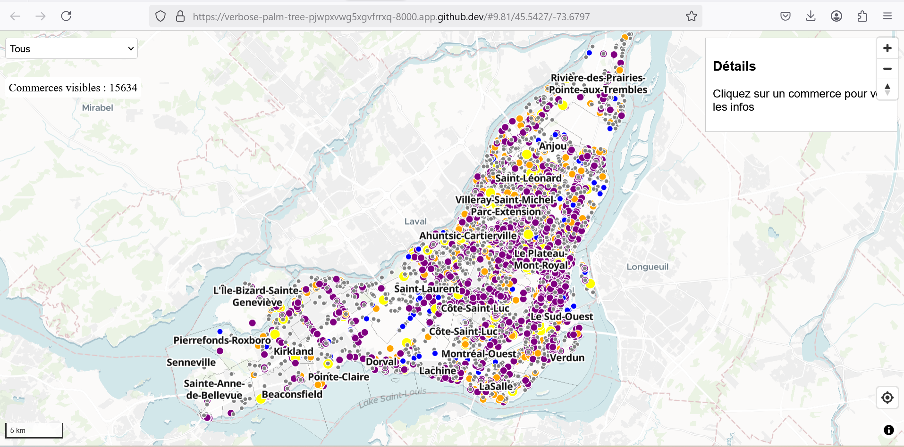

# LABORATOIRE 11

# Étape 1 – Initialisation de la carte
Dans cette première étape, la carte est initialisée à l'aide de MapLibreGL. 
On y configure le fond de carte, la position initiale de la vue, et on ajoute des contrôles tels que la navigation, la géolocalisation et l'échelle.

var map = new maplibregl.Map({
    container: 'map',
    style: 'https://api.maptiler.com/maps/dataviz/style.json?key=YOUR_KEY',
    center: [-73.55, 45.55],
    zoom: 9,
    hash: true
});

map.addControl(new maplibregl.NavigationControl(), 'top-right');
map.addControl(new maplibregl.GeolocateControl({ positionOptions: { enableHighAccuracy: true }, trackUserLocation: true }), 'bottom-right');
map.addControl(new maplibregl.ScaleControl({ unit: 'metric' }));

# Étape 2 – Définition des couches
Les couches de données représentant les commerces et les arrondissements sont définies sous forme de variables JS. 
Elles contiennent les sources GeoJSON ainsi que les propriétés d'affichage (symbologie, couleurs, filtres).

var commercesSource = {
  type: 'geojson',
  data: 'https://donnees.montreal.ca/…/businesses.geojson'
};

var commercesLayer = {
  id: 'commerces',
  type: 'circle',
  source: 'commerces_source',
  paint: {
    'circle-radius': ['match', ['get', 'type'], 'Épicerie', 5, 'Restaurant', 6, 4],
    'circle-color': ['match', ['get', 'type'], 'Épicerie', 'orange', 'Restaurant', 'purple', 'grey'],
    'circle-stroke-color': '#fff',
    'circle-stroke-width': 1
  },
  filter: ['==', ['get', 'statut'], 'Ouvert']
};

# Étape 3 – Chargement des couches
Les sources et couches précédemment définies sont injectées dans la carte au chargement grâce à l’événement 'load'.

map.on('load', function () {
  map.addSource('commerces_source', commercesSource);
  map.addSource('arrondissements_source', arrondissementsSource);
  map.addLayer(arrondissementsLayer);
  map.addLayer(commercesLayer);
  map.addLayer(arrondissementsLabelsLayer);
});

# Étape 4 – Interactions avec la souris
Cette étape permet d'ajouter des interactions avec la souris : survol (curseur en pointeur), clic (popup avec zoom) et mise à jour d’un panneau latéral avec les informations du commerce sélectionné.

map.on('click', 'commerces', (e) => {
  var props = e.features[0].properties;
  var coords = e.features[0].geometry.coordinates;
  new maplibregl.Popup().setLngLat(coords).setHTML(`<strong>${props.nom}</strong> Type : ${props.type}`).addTo(map);
  map.flyTo({ center: coords, zoom: 15, speed: 0.8 });
  document.getElementById('sidebar').innerHTML = `<h3>${props.nom}</h3>
<strong>Type :</strong> ${props.type}

<strong>Statut :</strong> ${props.statut}
`;
});

# Étape 5 – Fonctionnalités avancées : filtres et statistiques
Un menu déroulant permet de filtrer dynamiquement les types de commerces visibles. 
Un compteur indique le nombre de commerces actuellement affichés. Ces éléments rendent l’application interactive et informative pour l’utilisateur final.

document.getElementById('filtreType').addEventListener('change', function () {
  const type = this.value;
  if (type === 'Tous') {
    map.setFilter('commerces', ['==', ['get', 'statut'], 'Ouvert']);
  } else {
    map.setFilter('commerces', ['all', ['==', ['get', 'statut'], 'Ouvert'], ['==', ['get', 'type'], type]]);
  }
});

function mettreAJourCompteur() {
  const features = map.queryRenderedFeatures({ layers: ['commerces'] });
  document.getElementById('compteur').innerText = `Commerces visibles : ${features.length}`;
}

map.on('moveend', mettreAJourCompteur);

# RESULTAT FINAL

