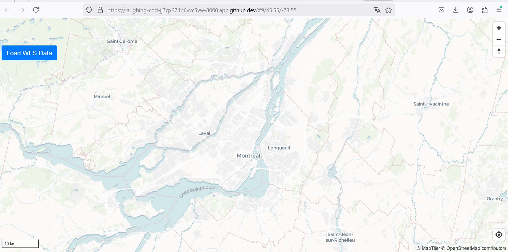

# Laboratoire 12

# Etape 1 : Initialisation de la carte et des contrôles (app.js)

La carte est créée avec MapLibreGL. Des outils de navigation, géolocalisation et une échelle sont ajoutés pour enrichir l'interactivité.

# Étape 2 – Génération des points aléatoires (randomPoints.js)

Pour tester le clustering, 2000 points sont générés aléatoirement dans une zone géographique autour de Montréal.

Étape 3 – Structure HTML de l'application (index.html)

La page web est composée de la carte principale et de boutons pour charger les données et générer les clusters.

